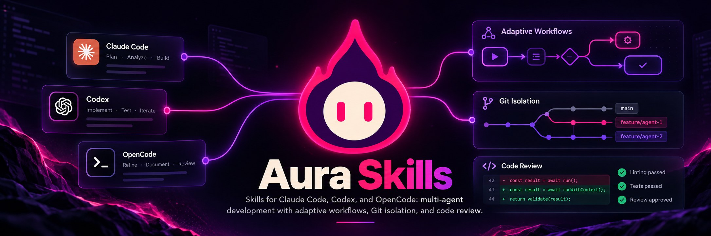

<p align="center"></p>

# Aura Skills

*[Read in English](README.md)* · La versión principal es la inglesa. Las skills están en inglés:
los modelos las siguen igual de bien, y tus agentes te van a seguir respondiendo en tu idioma.

**Enseñales a tus agentes de IA de programación a trabajar en equipo, sin convertir cada pedido
en un proyecto.**

Aura Skills son archivos de instrucciones que los agentes de IA de programación (Claude Code,
Codex, OpenCode) cargan solos cuando una tarea los necesita. Con ellas instaladas, tus agentes:

- **miden cada pedido antes de actuar.** Un typo se arregla directo. Una funcionalidad lleva unos
  pocos criterios verificables y una revisión. Un trabajo grande se reparte entre agentes.
- **no se pisan.** Cada tarea tiene su propia rama y su propia carpeta (un worktree de git).
- **entregan con honestidad.** Cada entrega dice qué se hizo, con el número real de tests, y qué
  **no** se verificó.
- **tienen un segundo par de ojos.** Alguien distinto de quien construyó revisa antes de integrar,
  y puede devolver el trabajo aunque los tests pasen.
- **reparten según lo que cada modelo hace bien de verdad**, con un catálogo de modelos fechado.

Salen de cómo el equipo de [Aura](https://aura-ai.dev) construye Aura: seis agentes de tres
proveedores trabajando en paralelo sobre tres repositorios. Funcionan **con o sin** Aura.

> **El proceso se adapta al trabajo. Nunca el trabajo al proceso.**

## Empezar

Necesitás `git` y al menos un agente de IA de programación. Elegí una forma de instalar:

**Con el CLI de [skills](https://skills.sh)**: la más rápida, y funciona con más de 20 agentes
(Claude Code, Codex, OpenCode, Cursor, Copilot, Windsurf, Gemini…):

```bash
cd tu-proyecto
npx skills add aura-ai-suite/aura-skills
```

Ese CLI le manda a skills.sh conteos anónimos de instalación. Para desactivarlo, usá
`DISABLE_TELEMETRY=1`.

**Con nuestro instalador**: para Claude Code, Codex y OpenCode. Además puede crear el perfil del
proyecto, y actualiza las skills que nunca editaste sin tocar las que cambiaste:

```bash
git clone https://github.com/aura-ai-suite/aura-skills.git
cd tu-proyecto
../aura-skills/install.sh --profile
```

Listo: las skills funcionan desde ya, con valores por defecto razonables. Cuando tengas cinco
minutos, adaptá la política de git a tu equipo (más abajo).

### Tu primer prompt

No hace falta nombrar las skills. Pedí como siempre: el agente las carga cuando aplican.

- *«Arreglá el typo del botón de login.»* → lo hace directo, sin proceso.
- *«Agregá recuperar la contraseña por email.»* → anuncia el modo («Builder + Gate · crítica, toca
  auth»), escribe 3 a 5 criterios verificables, construye y después revisa contra ellos.
- *«Sos el líder. Repartí estas cinco tareas entre codex-1 y opencode-1 y revisá lo que
  entreguen.»* → escribe specs, reparte según el modelo y hace el Gate de cada rama.
- *«Sos constructor. Tomá la tarea `password-reset`.»* → se aísla en un worktree, construye y
  entrega un handoff.

## Qué trae, y qué hacés con cada archivo

**Solo hacen falta las cinco skills.** Todo lo demás es opcional.

| Archivo | Qué hace | Qué hacés vos |
|---|---|---|
| [`aura-workflow`](skills/aura-workflow/SKILL.md) | La puerta de entrada. Mide cada pedido en dos ejes —cuánto proceso (directo · constructor + revisor · equipo) y cuánta verificación (normal · elevada · crítica)— y elige el modo más liviano que cubre el riesgo. También cubre el buzón de Aura y cómo retomar después de un corte. | ✅ **Usala tal cual** |
| [`aura-lead`](skills/aura-lead/SKILL.md) | Para el agente que planifica, reparte y revisa. Convierte pedidos en specs verificables, reparte para que los agentes no choquen, y hace el **Gate**: verifica cada entrega y puede rechazarla. Carga sus guías de [specs](skills/aura-lead/references/spec.md), [reparto](skills/aura-lead/references/assignment.md) y [Gate](skills/aura-lead/references/gate.md) solo cuando hacen falta. | ✅ **Usala tal cual** |
| [`aura-builder`](skills/aura-builder/SKILL.md) | Para el agente que construye. Una tarea, aislada, verificada con números y entregada con un handoff honesto. Nunca mergea. | ✅ **Usala tal cual** |
| [`aura-git-isolation`](skills/aura-git-isolation/SKILL.md) | Una tarea = una rama = un worktree, staging seguro, commits que dicen qué agente los hizo. **Empieza con tu política de git:** rama base, rama destino, forma de integrar, convención de commits. | ✏️ **Adaptala una vez** a tu empresa o a tu git flow. Hasta que lo hagas, funciona con los valores por defecto |
| [`aura-model-roster`](skills/aura-model-roster/SKILL.md) | Un catálogo fechado de los modelos detrás de tus agentes: nivel, fortalezas y debilidades, precio, límites, privacidad, navegador. El líder lo usa para decidir quién toma cada tarea. | 🔄 **Mantenela al día.** Los modelos cambian cada mes. Actualizala vos, o reinstalá para recibir la nuestra. El líder te avisa cuando tiene más de 30 días |
| `.aura/board.md` · `.aura/history.md` | El tablero de tareas (qué está en curso y el handoff de cada tarea) y el historial (qué se hizo y cómo salió la revisión). Se versionan con tu código, así el estado del equipo sobrevive a una compu apagada o a un agente nuevo. | 🤖 **Los crea el líder** la primera vez que reparte trabajo entre agentes (modo equipo). No se crean para pedidos chicos. ¿Ya tenés los tuyos? Nombralos en el perfil |
| [`.aura/project.md`](templates/project.md) | Perfil del proyecto, opcional: tus comandos de test, dónde van las specs, archivos compartidos, reglas de producto, tus agentes, y **un registro de cómo se portó cada modelo en tu proyecto.** | 📝 **Opcional.** Se crea con `--profile`. Sin él, los agentes leen tu `AGENTS.md`, el README y los scripts del proyecto |

**¿Por qué cortadas por rol?** El constructor no carga las reglas del revisor. Así un modelo más
barato que solo construye gasta su contexto en tu código, no en el proceso.

## Adaptá la política de git (una vez)

Abrí la copia **instalada** de `aura-git-isolation/SKILL.md` y completá la tabla **"Your git
policy"** de arriba. Dónde está:

| Instalada para | Claude Code | Codex y OpenCode |
|---|---|---|
| Un proyecto | `.claude/skills/aura-git-isolation/` | `.agents/skills/aura-git-isolation/` |
| Todos tus proyectos (`--user`) | `~/.claude/skills/aura-git-isolation/` | `~/.agents/skills/aura-git-isolation/` |

Si usás Claude Code y otra herramienta, hay dos copias: editá una y copiala sobre la otra.

Lo que dejes vacío usa el valor por defecto: una rama por tarea desde tu rama principal, cada constructor
pushea su propia rama, el revisor integra después de preguntarte, Conventional Commits.

| Si tu equipo usa… | Poné |
|---|---|
| GitHub flow / trunk-based | base y destino `main`, integración `pull-request` |
| Git flow | base y destino `develop`; las releases las corta una persona |
| Una rama de staging | base `main`, destino `staging` |
| Solo vos y un agente | integración `solo`: nada se pushea ni se mergea si no lo pedís |

Instalala con `--user` y todos tus repositorios siguen la misma política. El instalador **nunca
pisa una skill que modificaste**, así que tus cambios sobreviven a las actualizaciones. Para
recibir más adelante una versión nueva de esta skill, reinstalá con `--force` y copiá tu tabla
desde el respaldo que te indica.

**Protegé también la rama destino** en GitHub o GitLab. «El constructor nunca mergea» es una
instrucción para un modelo. Una rama protegida es una garantía.

## Mantené el catálogo de modelos al día

El catálogo tiene una fecha de **"Last reviewed"**. Cuando pasan más de 30 días, el líder te avisa
antes de repartir trabajo y te ofrece actualizarlo. Para actualizarlo:

- **Recibí el nuestro:** `git pull` en `aura-skills` y volvé a correr `install.sh`. Las skills que
  nunca editaste se actualizan solas: el instalador guarda una huella de lo que instaló y se da
  cuenta.
- **Hacelo vos:** pedile a tu agente líder que lo actualice. Cada número del catálogo enlaza a la
  página del proveedor, y la §6 explica cómo actualizarlo.

Cómo se portaron los modelos **en tu proyecto** va en el registro de `.aura/project.md`, no en el
catálogo. Ese registro pesa más que cualquier benchmark, y actualizar el catálogo nunca lo borra.

## Opciones del instalador

```bash
./install.sh [--project <dir> | --user] [--tool claude|codex|opencode]... [--profile] [--force] [--dry-run]
```

| Opción | Qué hace |
|---|---|
| `--project <dir>` | Instala en ese repositorio (por defecto, la carpeta actual) |
| `--user` | Instala para todos tus proyectos |
| `--tool <nombre>` | Solo para esa herramienta. Se puede repetir. Por defecto, las que estén en tu `PATH`; si no detecta la tuya (por ejemplo, instalada con nvm), pasala |
| `--profile` | Crea también `.aura/project.md` desde la plantilla, marcado **DRAFT** hasta que lo completes |
| `--force` | Reemplaza las skills que modificaste. Tu copia va a `~/.aura/skills-backup/` |
| `--dry-run` | Muestra qué cambiaría, sin tocar nada |

### Dónde busca las skills cada herramienta

Medido el 2026-10-08 en Linux, poniendo una skill de prueba en cada carpeta y preguntándole a
cada herramienta cuáles ve.

| Herramienta (versión) | Proyecto | Usuario | `install.sh` usa |
|---|---|---|---|
| Claude Code 2.1.294 | `.claude/skills` | `~/.claude/skills` | `.claude/skills` |
| Codex CLI 0.161.0 | `.agents/skills`, `.codex/skills` | `~/.agents/skills`, `~/.codex/skills` | `.agents/skills` |
| OpenCode 1.18.35 | `.opencode/skills`, `.claude/skills`, `.agents/skills` | `~/.config/opencode/skills`, `~/.claude/skills`, `~/.agents/skills` | `.agents/skills` |

Con dos carpetas (`.claude/skills` y `.agents/skills`) alcanza para las tres. OpenCode lee las dos
y lista cada skill una sola vez.

**Windows, o a mano:** copiá cada carpeta de `skills/` a la carpeta de skills de tu herramienta,
según la tabla. **Antigravity:** sin verificar todavía.

## ¿Necesito Aura?

No. Sin Aura, las skills funcionan igual: un agente solo, o varios con vos pasando los mensajes.

Con [Aura Desktop](https://app.aura-ai.dev/install), cada agente de Claude Code, Codex u OpenCode
que abrís en una de sus terminales tiene el servidor MCP `aura-mailbox`, y las skills le enseñan a:
contar qué está haciendo (`set_status`), leer las reglas que fijaste para la sesión
(`list_peers`), pedir y entregar trabajo (`send_message` con `kind: request` / `handoff`) y anotar
tareas en el tablero de la sesión (`update_task`). Necesita Aura Runtime 0.1.0-beta.6 o posterior.

## Escribí tus propias skills (opcional)

Para el flujo de Aura no necesitás ninguna. Si querés una para lo que es tuyo —qué es tu repo, tu
design system—, una skill es una carpeta con un `SKILL.md`:

```markdown
---
name: mi-repo-contexto
description: Qué es mi-repo y qué no, su glosario y sus fronteras. Usala en tu primera tarea acá.
---

# mi-repo — contexto
…
```

La `description` es lo que el agente lee para decidir cuándo cargarla: escribila como «cuándo» +
«qué». Mantenela corta: pasadas las ~170 líneas, nadie la lee entera.

## Lo que no hacen (todavía)

Para que nadie lo suponga:

- **No garantizan exclusividad.** Dos agentes podrían tomar la misma tarea. Por eso nada está
  asignado hasta que el otro agente confirma. El tablero del buzón de Aura muestra, no asigna.
- **No hacen cumplir permisos.** Protegé tus ramas en tu proveedor de git.
- **No saben qué modelo hay detrás de cada agente** si no lo escribís en el perfil.
- **Aura todavía no las instala por vos:** usá `npx skills add`, `install.sh`, o copialas a
  mano.

## Licencia

[MIT](LICENSE)
